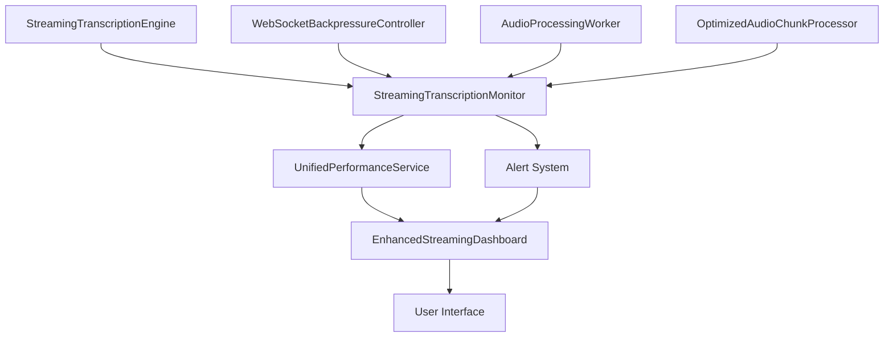

# Monitoring Integration Documentation

## Overview

This document describes the integration of the streaming transcription system with the existing monitoring infrastructure, providing comprehensive metrics collection, alerting, and performance visualization.

## Architecture

### Core Components

1. **StreamingTranscriptionMonitor** - Main monitoring service
2. **Enhanced UnifiedPerformanceService** - Extended performance service with streaming metrics
3. **EnhancedStreamingDashboard** - Real-time monitoring dashboard
4. **Alert System** - Configurable alerting with multiple severity levels

### Integration Points



## Implementation Details

### 1. Monitoring Service Integration

The `StreamingTranscriptionMonitor` class provides comprehensive monitoring for:

- **Session Metrics**: Active sessions, total sessions, average duration
- **Processing Metrics**: Chunks processed, processing times, success/error rates
- **Memory Metrics**: Current usage, peak usage, efficiency, pool utilization
- **Backpressure Metrics**: Activations, duration, circuit breaker trips
- **Stream Metrics**: Throughput, latency, buffer utilization
- **Quality Metrics**: Confidence scores, accuracy, processing quality

#### Usage Example:

```typescript
import { StreamingTranscriptionEngine } from './StreamingTranscriptionEngine'
import { StreamingTranscriptionMonitor } from './StreamingTranscriptionMonitor'

// Create monitor with custom alert configuration
const monitor = new StreamingTranscriptionMonitor({
  memoryUsageThreshold: 100 * 1024 * 1024, // 100MB
  processingTimeThreshold: 5000, // 5 seconds
  errorRateThreshold: 5 // 5%
})

// Create streaming engine
const engine = new StreamingTranscriptionEngine({
  enableMetrics: true,
  realTimeProcessing: true
})

// Start monitoring a session
const sessionId = 'session-1'
monitor.startSessionMonitoring(sessionId, engine)

// Set up alert handling
const unsubscribe = monitor.onAlert((alert) => {
  console.log('Alert received:', alert)
  // Handle alert (send notification, log, etc.)
})

// Process audio with monitoring
const session = await engine.startStreamingTranscription(
  sessionId,
  (result) => {
    // Record successful processing
    monitor.recordChunkProcessing(sessionId, result, 150) // 150ms processing time
  },
  (error) => {
    // Record processing error
    monitor.recordProcessingError(sessionId, error)
  }
)

// Add audio chunks
await session.addAudioChunk(audioData1)
await session.addAudioChunk(audioData2, true) // Last chunk

// Stop monitoring when session ends
monitor.stopSessionMonitoring(sessionId)
```

### 2. Performance Service Enhancement

The `UnifiedPerformanceService` has been extended to support streaming metrics:

#### New Methods:

- `addStreamingMetrics(metrics: StreamingPerformanceMetrics)` - Add streaming performance data
- `getStreamingStats()` - Get streaming statistics and trends
- `getCombinedPerformanceReport()` - Get unified transcription + streaming report

#### Integration Example:

```typescript
import { UnifiedPerformanceService } from './unified-performance'

const performanceService = UnifiedPerformanceService.getInstance()

// The monitoring system automatically calls this
performanceService.addStreamingMetrics({
  activeSessions: 2,
  totalChunksProcessed: 150,
  averageProcessingTime: 120,
  successRate: 98.5,
  memoryUsage: 45 * 1024 * 1024, // 45MB
  backpressureActivations: 3,
  qualityScore: 87.2
})

// Get comprehensive performance report
const report = performanceService.getCombinedPerformanceReport()
console.log('System Health:', report.overall.systemHealth)
console.log('Recommendations:', report.overall.recommendations)
```

### 3. Alert System

The alert system provides configurable thresholds and multiple severity levels:

#### Alert Types:

- **Memory Alerts**: High usage, low efficiency
- **Performance Alerts**: Slow processing, high error rates
- **Backpressure Alerts**: Frequent activations, circuit breaker trips
- **Quality Alerts**: Low confidence, poor accuracy

#### Configuration:

```typescript
const alertConfig = {
  // Memory thresholds
  memoryUsageThreshold: 100 * 1024 * 1024, // 100MB
  memoryEfficiencyThreshold: 70, // 70%
  
  // Performance thresholds
  processingTimeThreshold: 5000, // 5 seconds
  errorRateThreshold: 5, // 5%
  successRateThreshold: 95, // 95%
  
  // Backpressure thresholds
  backpressureFrequencyThreshold: 10, // per minute
  circuitBreakerThreshold: 3, // per hour
  
  // Quality thresholds
  confidenceThreshold: 0.7, // 70%
  accuracyThreshold: 85 // 85%
}

const monitor = new StreamingTranscriptionMonitor(alertConfig)
```

#### Alert Handling:

```typescript
monitor.onAlert((alert) => {
  switch (alert.severity) {
    case 'critical':
      // Send immediate notification
      sendCriticalAlert(alert)
      break
    case 'error':
      // Log error and notify admin
      logError(alert)
      notifyAdmin(alert)
      break
    case 'warning':
      // Log warning
      logWarning(alert)
      break
    case 'info':
      // Informational logging
      logInfo(alert)
      break
  }
})
```

### 4. Dashboard Integration

The `EnhancedStreamingDashboard` component provides real-time visualization:

#### Features:

- **Real-time Metrics**: Auto-refreshing dashboard with current metrics
- **Alert Management**: View and dismiss active alerts
- **Performance Trends**: Historical data and trend analysis
- **System Health**: Overall system health assessment
- **Recommendations**: Actionable recommendations based on metrics

#### Usage:

```tsx
import React from 'react'
import { EnhancedStreamingDashboard } from './EnhancedStreamingDashboard'
import { monitor } from './monitoring-setup'

const MonitoringPage: React.FC = () => {
  return (
    <div className="container mx-auto p-4">
      <h1 className="text-3xl font-bold mb-6">System Monitoring</h1>
      
      <EnhancedStreamingDashboard
        monitor={monitor}
        refreshInterval={2000} // 2 seconds
        enableAlerts={true}
      />
    </div>
  )
}
```

## Metrics Collected

### Session Metrics
- `activeSessions` - Currently active transcription sessions
- `totalSessions` - Total sessions since startup
- `averageSessionDuration` - Average session length in milliseconds

### Processing Metrics
- `chunksProcessed` - Total audio chunks processed
- `totalProcessingTime` - Cumulative processing time
- `averageChunkProcessingTime` - Average time per chunk
- `successRate` - Percentage of successful processing
- `errorRate` - Percentage of failed processing

### Memory Metrics
- `currentMemoryUsage` - Current memory usage in bytes
- `peakMemoryUsage` - Peak memory usage since startup
- `memoryEfficiency` - Memory efficiency percentage
- `objectPoolUtilization` - Object pool usage percentage

### Backpressure Metrics
- `backpressureActivations` - Number of backpressure activations
- `averageBackpressureDuration` - Average backpressure duration
- `circuitBreakerTrips` - Circuit breaker activations
- `adaptiveDelayAdjustments` - Adaptive delay adjustments

### Stream Metrics
- `streamThroughput` - Processing throughput (chunks/second)
- `streamLatency` - Processing latency in milliseconds
- `bufferUtilization` - Buffer usage percentage

### Quality Metrics
- `averageConfidence` - Average confidence score (0-1)
- `transcriptionAccuracy` - Transcription accuracy percentage
- `processingQuality` - Overall quality assessment

## Performance Monitoring

### Health Scoring

The system calculates an overall health score based on:

- **Success Rate** (30% weight)
- **Average Confidence** (25% weight)
- **Memory Efficiency** (20% weight)
- **Processing Speed** (15% weight)
- **Reliability** (10% weight)

### Trend Analysis

The monitoring system tracks trends for:

- Memory usage (increasing/decreasing/stable)
- Processing time trends
- Error rate patterns
- Confidence score trends

### Recommendations

The system provides actionable recommendations:

- Memory optimization suggestions
- Performance tuning advice
- Error pattern analysis
- Configuration adjustments

## Alert Configuration

### Default Thresholds

```typescript
const DEFAULT_ALERT_CONFIG = {
  memoryUsageThreshold: 100 * 1024 * 1024, // 100MB
  memoryEfficiencyThreshold: 70, // 70%
  processingTimeThreshold: 5000, // 5 seconds
  errorRateThreshold: 5, // 5%
  successRateThreshold: 95, // 95%
  backpressureFrequencyThreshold: 10, // 10 per minute
  circuitBreakerThreshold: 3, // 3 per hour
  confidenceThreshold: 0.7, // 70%
  accuracyThreshold: 85 // 85%
}
```

### Customization

You can customize alert thresholds based on your requirements:

```typescript
const customConfig = {
  ...DEFAULT_ALERT_CONFIG,
  memoryUsageThreshold: 200 * 1024 * 1024, // 200MB for high-capacity systems
  processingTimeThreshold: 10000, // 10 seconds for complex processing
  errorRateThreshold: 2 // Stricter error tolerance
}
```

## Integration with Existing Systems

### Logging Integration

The monitoring system integrates with existing logging:

```typescript
// Monitor events are automatically logged
monitor.onAlert((alert) => {
  logger.log(alert.severity, alert.message, {
    metric: alert.metric,
    value: alert.value,
    threshold: alert.threshold,
    sessionId: alert.sessionId
  })
})
```

### Notification Integration

Alerts can be integrated with notification systems:

```typescript
monitor.onAlert(async (alert) => {
  if (alert.severity === 'critical') {
    await sendSlackNotification(alert)
    await sendEmailAlert(alert)
  }
})
```

### Metrics Export

Metrics can be exported to external monitoring systems:

```typescript
setInterval(() => {
  const metrics = monitor.getMetrics()
  const report = performanceService.getCombinedPerformanceReport()
  
  // Export to Prometheus, DataDog, etc.
  exportMetrics(metrics, report)
}, 30000) // Every 30 seconds
```

## Troubleshooting

### Common Issues

1. **High Memory Alerts**
   - Enable memory optimizations in streaming config
   - Reduce chunk size or buffer size
   - Check for memory leaks in processing pipeline

2. **Frequent Backpressure**
   - Increase buffer sizes
   - Reduce processing delay
   - Scale processing resources

3. **Low Confidence Scores**
   - Check audio quality
   - Verify model performance
   - Review preprocessing settings

4. **High Error Rates**
   - Check network connectivity
   - Verify API credentials
   - Review error logs for patterns

### Debugging

Enable detailed logging for troubleshooting:

```typescript
const monitor = new StreamingTranscriptionMonitor({
  enableDetailedLogging: true,
  logLevel: 'debug'
})
```

Access detailed metrics:

```typescript
const detailedReport = monitor.generateReport()
console.log('Detailed monitoring report:', detailedReport)
```

## Best Practices

1. **Monitor Continuously**: Set up continuous monitoring with appropriate refresh intervals
2. **Configure Alerts**: Set meaningful thresholds based on your system requirements
3. **Trend Analysis**: Regularly review metrics trends to identify issues early
4. **Resource Planning**: Use metrics to plan resource scaling and optimization
5. **Documentation**: Document custom configurations and alert procedures

This monitoring integration provides comprehensive observability into the streaming transcription system, enabling proactive issue detection and performance optimization.
