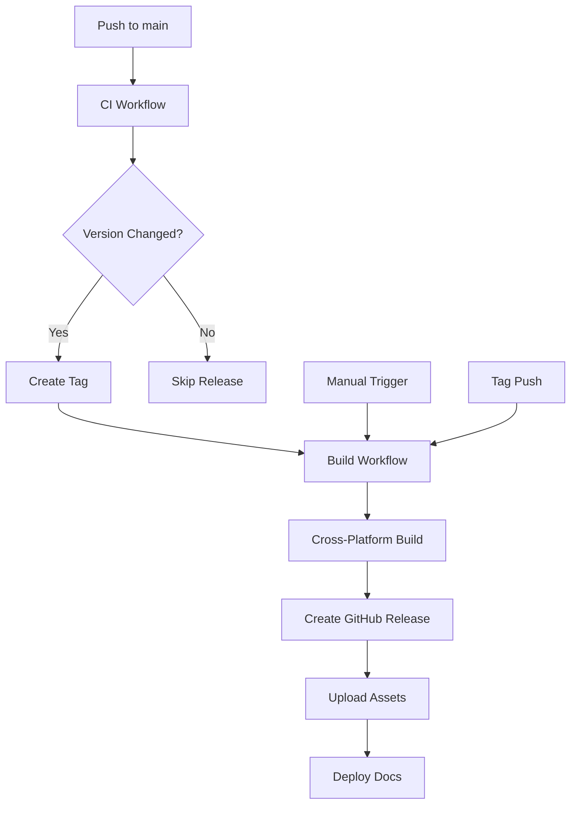

# Publishing and Release Guide for DAO Copilot

This guide walks you through setting up and using the automated publishing pipeline for DAO Copilot.

## 🚀 Quick Start

### 1. Initial Setup

After merging the CI/CD pipeline PR, follow these steps to configure your repository:

#### Enable GitHub Pages
1. Go to your repository Settings → Pages
2. Under "Source", select "GitHub Actions"
3. This enables automatic documentation deployment

#### Configure Repository Settings (Automatic)
Run the repository setup workflow to automatically configure:
- Labels for issue/PR management
- Branch protection rules
- Repository metadata and topics

```bash
# Trigger the setup workflow
# Go to Actions → Repository Setup → Run workflow
```

### 2. Publishing Configuration

#### GitHub Releases (Automatic)
No additional setup required. The pipeline automatically:
- Publishes to GitHub Releases
- Uses `GITHUB_TOKEN` (automatically provided)
- Attaches cross-platform installers

#### NPM Publishing (Optional)
To enable npm publishing:

1. Generate an NPM token:
   - Go to [npm.com](https://www.npmjs.com) → Account → Access Tokens
   - Create a new "Publish" token

2. Add the token to GitHub Secrets:
   - Go to Repository Settings → Secrets and Variables → Actions
   - Add new secret: `NPM_TOKEN` with your npm token

#### Code Signing (Optional but Recommended)

##### Windows Code Signing
1. Obtain a code signing certificate (`.p12` file)
2. Add to repository secrets:
   ```
   WIN_CERT_PASSWORD=your_certificate_password
   ```
3. Place certificate file at `certificates/windows.p12`

##### macOS Code Signing
1. Obtain Apple Developer certificates
2. Add to repository secrets:
   ```
   APPLE_ID=your_apple_id
   APPLE_ID_PASSWORD=your_app_specific_password
   CSC_LINK=base64_encoded_certificate
   CSC_KEY_PASSWORD=certificate_password
   NOTARIZE=true
   ```

## 🏗️ Release Workflow

### Method 1: Automated Version Management (Recommended)

Use the built-in scripts for streamlined releases:

```bash
# Prepare a patch release (1.0.0 → 1.0.1)
npm run release:prepare

# Prepare a minor release (1.0.0 → 1.1.0) 
npm run release:prepare:minor

# Prepare a major release (1.0.0 → 2.0.0)
npm run release:prepare:major
```

These scripts will:
- ✅ Check git status and branch
- ✅ Run tests and quality checks
- ✅ Bump version in package.json
- ✅ Generate changelog draft
- ✅ Create git commit and tag
- ✅ Optionally push changes

### Method 2: Manual Version Bump

```bash
# Quick release (just version bump + push)
npm run release         # patch
npm run release:minor   # minor  
npm run release:major   # major
```

### Method 3: GitHub Actions Manual Trigger

1. Go to Actions → "Build and Release"
2. Click "Run workflow"
3. Select version and options
4. Click "Run workflow"

## 📦 Build and Distribution

### Local Building

```bash
# Build for all platforms
npm run distribute

# Build for specific platform
npm run build:win    # Windows
npm run build:mac    # macOS
npm run build:linux  # Linux

# Build and publish immediately
npm run distribute:publish
```

### Platform-Specific Builds

The pipeline automatically builds for:

| Platform | Formats | Architecture |
|----------|---------|-------------|
| Windows | `.exe`, `.exe` (portable) | x64, arm64 |
| macOS | `.dmg`, `.zip` | x64, arm64, universal |
| Linux | `.AppImage`, `.deb`, `.rpm`, `.snap`, `.tar.gz` | x64, arm64 |

### Distribution Files

After a release, users can download:

- **Windows**: `DAO-Copilot-1.0.0-x64-setup.exe`
- **macOS**: `DAO-Copilot-1.0.0-arm64.dmg` 
- **Linux**: `DAO-Copilot-1.0.0-x64.AppImage`

## 🔄 Automated Workflows

### CI/CD Pipeline Overview



### Workflow Triggers

| Workflow | Triggers | Purpose |
|----------|----------|---------|
| **CI** | Push, PR | Testing, linting, security |
| **Build & Release** | Tags, manual | Cross-platform builds |
| **Release** | Version change in main | Auto-tagging |
| **Publish** | Releases | Package registries |
| **Deploy** | Main branch, releases | Documentation |

### Auto-Updates

The electron-builder configuration includes auto-update support:

```yaml
# In electron-builder.yml
publish:
  - provider: github
    owner: wysRocket
    repo: dao-copilot
    token: ${env.GH_TOKEN}
  - provider: generic
    url: https://wysrocket.github.io/dao-copilot/releases/
```

## 🔧 Configuration Files

### Key Configuration Files

- **`.github/workflows/`** - GitHub Actions workflows
- **`electron-builder.yml`** - Build configuration
- **`package.json`** - Scripts and metadata
- **`.github/dependabot.yml`** - Dependency management
- **`scripts/`** - Build and release scripts

### Environment Variables

| Variable | Purpose | Required | Where to Set |
|----------|---------|----------|--------------|
| `GITHUB_TOKEN` | GitHub API access | Auto | GitHub provides |
| `NPM_TOKEN` | npm publishing | Optional | Repository secrets |
| `GH_TOKEN` | Release publishing | Auto | GitHub provides |
| `WIN_CERT_PASSWORD` | Windows signing | Optional | Repository secrets |
| `APPLE_ID` | macOS notarization | Optional | Repository secrets |
| `NOTARIZE` | Enable macOS notarization | Optional | Repository secrets |

## 🚨 Troubleshooting

### Common Issues

#### Build Fails
```bash
# Check dependencies
npm ci

# Clean build
npm run clean
npm run build
```

#### Release Not Created
- Check if `GITHUB_TOKEN` has proper permissions
- Verify tag format (`v1.0.0`)
- Check workflow logs in Actions tab

#### Code Signing Fails
- Verify certificates are valid and not expired
- Check password secrets are correct
- Ensure certificate files are in correct locations

#### Auto-Update Not Working
- Check `publish` configuration in `electron-builder.yml`
- Verify GitHub releases have proper assets
- Test update server endpoints

### Debug Mode

Enable debug logging:

```bash
# Local debugging
DEBUG=electron-builder npm run build

# GitHub Actions debugging
# Add to workflow: ACTIONS_RUNNER_DEBUG: true
```

## 📈 Monitoring and Maintenance

### Regular Maintenance

1. **Monthly**: Review and merge Dependabot PRs
2. **Quarterly**: Update build tools and workflows
3. **As needed**: Renew code signing certificates

### Monitoring

- Watch GitHub Actions for failed builds
- Monitor download statistics in Releases
- Check for security vulnerabilities in Dependencies tab

### Analytics

Track release performance:
- Download counts per platform
- Update adoption rates
- Issue reports per version

## 🎯 Best Practices

### Version Management
- Use semantic versioning (semver)
- Tag releases consistently (`v1.0.0`)
- Maintain changelog for each release

### Security
- Keep dependencies updated (Dependabot helps)
- Sign releases when possible
- Review security alerts promptly

### Quality Assurance
- Always run tests before releasing
- Use staging/beta releases for major changes
- Monitor crash reports and user feedback

## 🔗 Resources

- [Electron Builder Documentation](https://www.electron.build/)
- [GitHub Actions Documentation](https://docs.github.com/en/actions)
- [Semantic Versioning](https://semver.org/)
- [npm Publishing Guide](https://docs.npmjs.com/packages-and-modules/contributing-packages-to-the-registry)

This comprehensive pipeline ensures reliable, automated publishing of DAO Copilot across all major platforms with minimal manual intervention.
